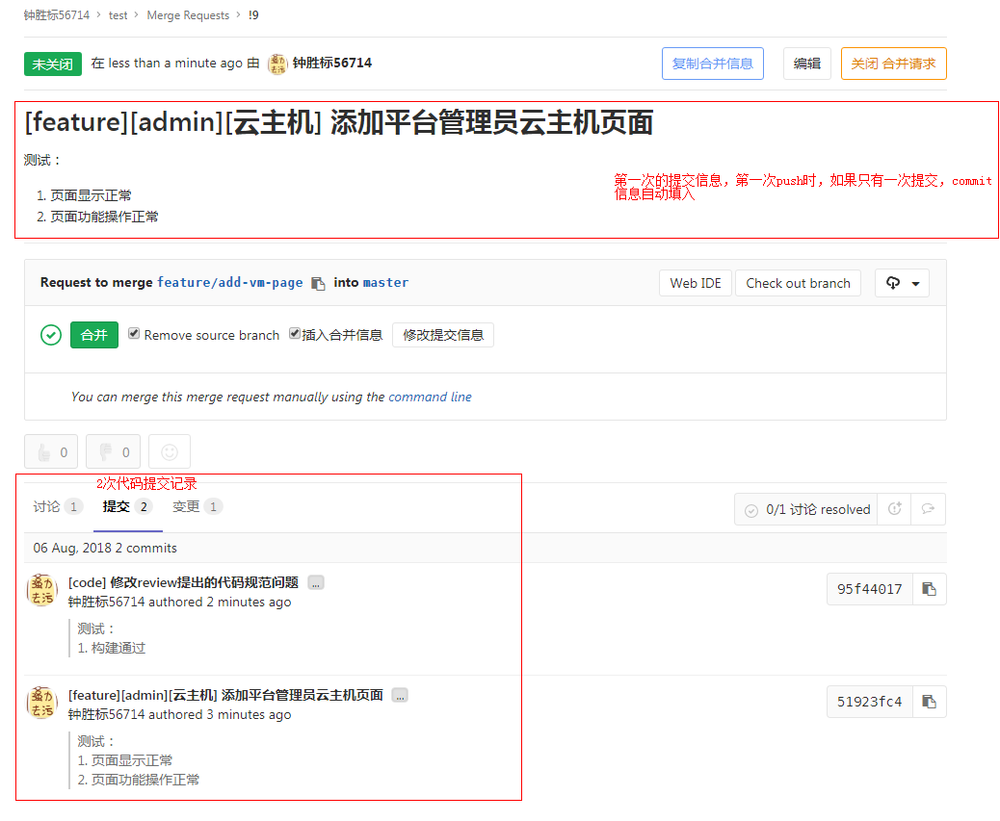
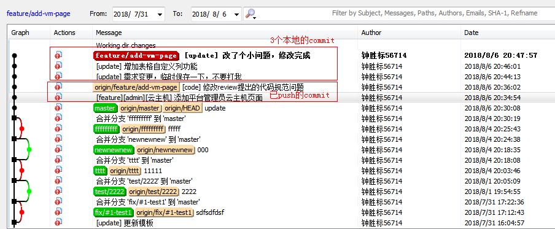
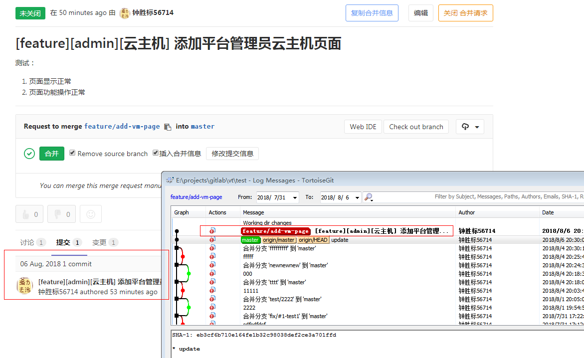
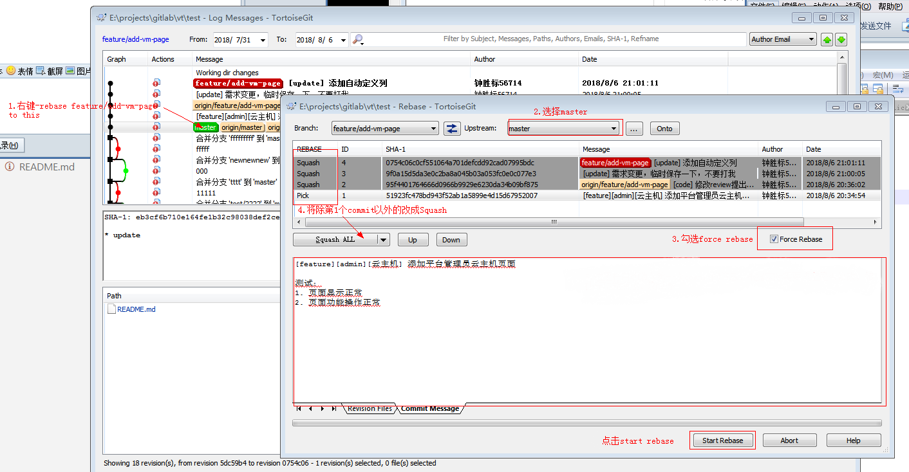
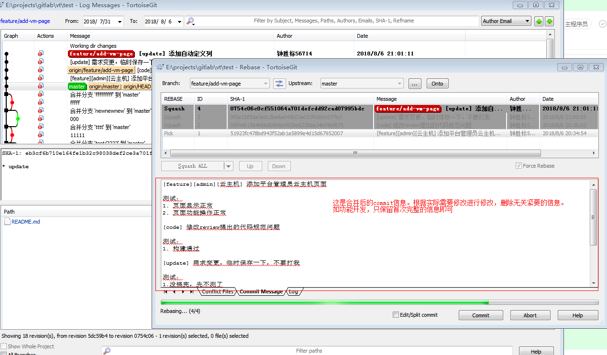
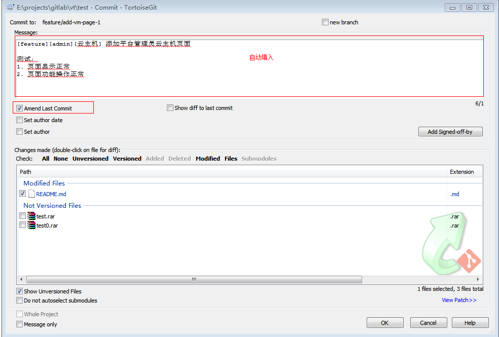

## 合并多次commit记录
_适用于git_

在开发一个任务的过程中，同一分支，可能会进行多次commit。而很多commit，只是为了修正以往commit的问题，或者只是临时保存当前代码。当这些commit合入主开发分支，查看git log，会发现很多无用的commit记录，不便于查找代码改动。

实际上，每个分支应该是独立的任务，正常情况下只需保留一次提交记录即可。而开发过程中难免需要提交，所以在代码合入前，需要对无关紧要的commit记录进行合并。**合并commit记录，应该在分支合入主开发发支前完成。**

可以使用命令行，或者GUI 合并commit信息。由于GUI工具操作简单，编写commit信息方便，且不易出错，推荐使用GUI工具合并多次commit，以下只介绍如何GUI进行commit合并。

合并commit，存在以下2种场景。

### 1.当前改动提交，已commit多次
这种情况是真正的合并多次commit，使用`rebase`操作
#### 当前分支情况，远程分支已push2次改动，本地分支存在3次未push分支

#### 合并后的效果

#### 改动步骤
1.选中首次commit记录的前次记录，右键->rebase "branch-name" onto this，按图里的步骤操作

2.根据实际需要精简、修改、补充commit信息

3.使用`git push -f`命令将commit push到远程

4.根据根据实际需要更新merge request信息，如果不需要则不用修改

### 2.当前改动提交前，只存在一次commit
这种情况是对前一次的commit进行修补，每次commit不新增commit记录，使用`commit`操作。

#### 操作步骤
1.commit时勾选`Amend Last Commit`

2.根据实际需要精简、修改、补充commit信息

3.使用`git push -f`命令将commit push到远程

### commit信息修改注意事项
如果在首次提交后，只是修改了注释、缩进等代码规范的问题，commit信息不用修改，直接使用首次的commit信息即可。

如果进行了业务的修改，导致首次的commit信息已不适用，或者增加了额外的业务逻辑，需要说明的，则需在首次的提交信息上进行修改、或者补充。

