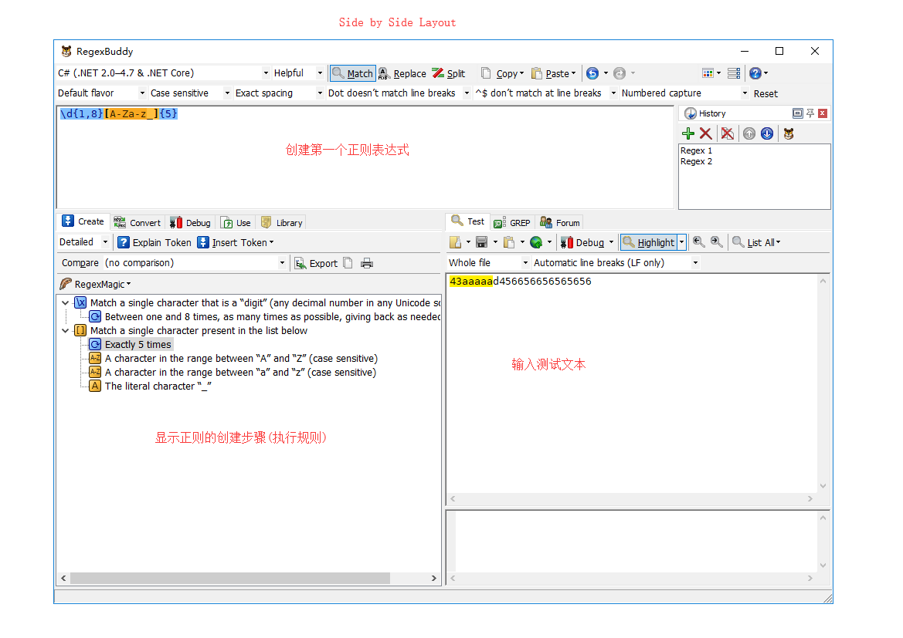
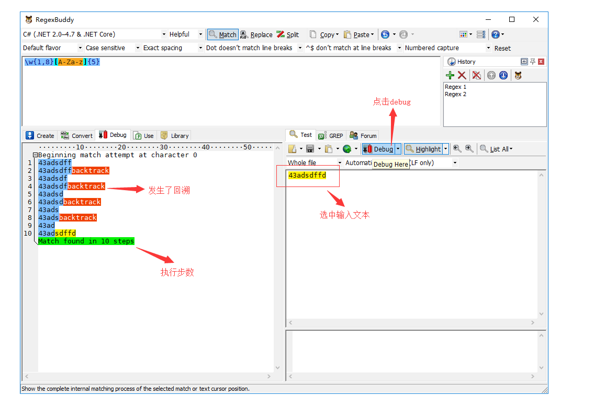
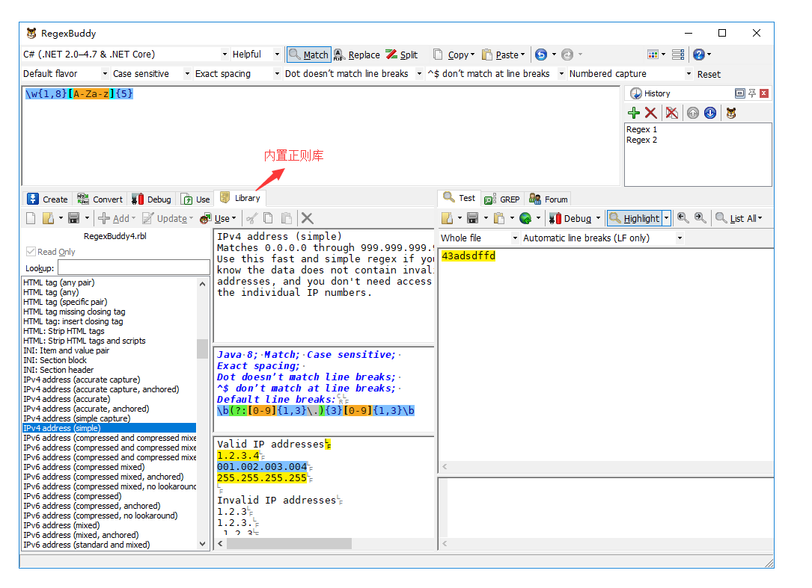

### 1. RegexBuddy介绍

RegexBuddy是个十分强大的正则表达式学习、记录及分析工具。通过RegexBuddy，你能看到正则一步步创建的过程。结合测试文本，你能看到正则一步步执行匹配的过程，这对于理解正则回溯和对正则进行进一步优化，都有极大的帮助。对此，特意编写此文章介绍RegexBuddy。

### 2. RegexBuddy的获取及安装

可以在RegexBuddy的[官方网站](https://www.regexbuddy.com/)下载及获取RegexBuddy。RegexBuddy需要付费，请支持下载及支持正版软件。

下载完后，一步步点击安装即可

### 3. RegexBuddy的界面介绍

下图便是RegexBuddy界面的各个面板及相关功能

### 4. 创建你的第一个正则

为了方便使用，可以在布局设置那里将布局设置成Side by Side Layout。

在正则输入区输入你的正则regex1，查看Create面板，就会发现面板上显示了正则的创建过程(或者说是匹配规则)，在Test面板区域输入你的测试文本，满足regex1匹配规则的部分会高亮显示，如下图所示。

### 5. 使用RegexBuddy的Debug功能

选中测试文本，点击debug就可以进入RegexBuddy的debug模式，个人觉得这是RegexBuddy最强大地方，因为它可以让你清楚地知道你输入的正则对测试文本的匹配过程，执行了多少步，哪里发生了回溯，哪里需要优化，你都能一目了然。

### 6. 使用RegexBuddy的Library功能

RegexBuddy的正则库内置了很多常用正则，日常编码过程中需要的很多正则表达式都能在该正则库中找到。

### 7. More

除开了以上介绍之外，RegexBuddy还有Convert（转换成别的编程语言的正则语法）等等强大的功能，更多功能请查看[官网文档](https://www.regexbuddy.com/manual.html)