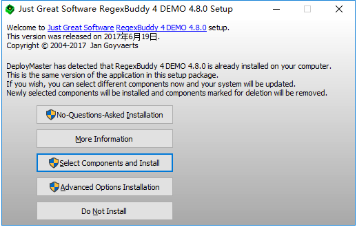
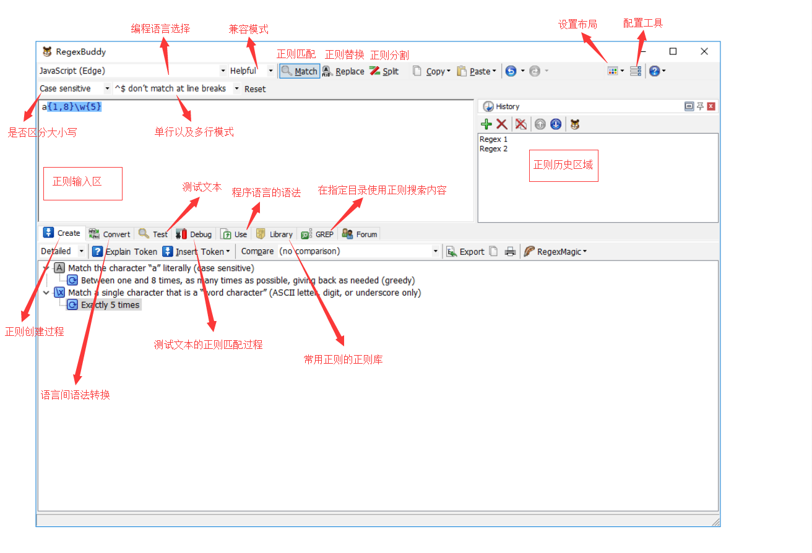

### 1. RegexBuddy介绍

RegexBuddy是个十分强大的正则表达式学习、记录及分析工具。通过RegexBuddy，你能看到正则一步步创建的过程。结合测试文本，你能看到正则一步步执行匹配的过程，这对于理解正则回溯和对正则进行进一步优化，都有极大的帮助。对此，特意编写此文章介绍RegexBuddy。

### 2. RegexBuddy的获取及安装

可以在RegexBuddy的[官方网站](https://www.regexbuddy.com/)下载及获取RegexBuddy。RegexBuddy需要付费，请支持下载及支持正版软件。

下载完后，一步步点击安装即可

### 3. RegexBuddy的界面介绍

下图便是RegexBuddy界面的各个面板及相关功能

### 4. 创建你的第一个正则

### 5. 使用RegexBuddy的Create功能

### 6. 使用RegexBuddy的Debug功能

### 7. 使用RegexBuddy的Library功能

### 8. more