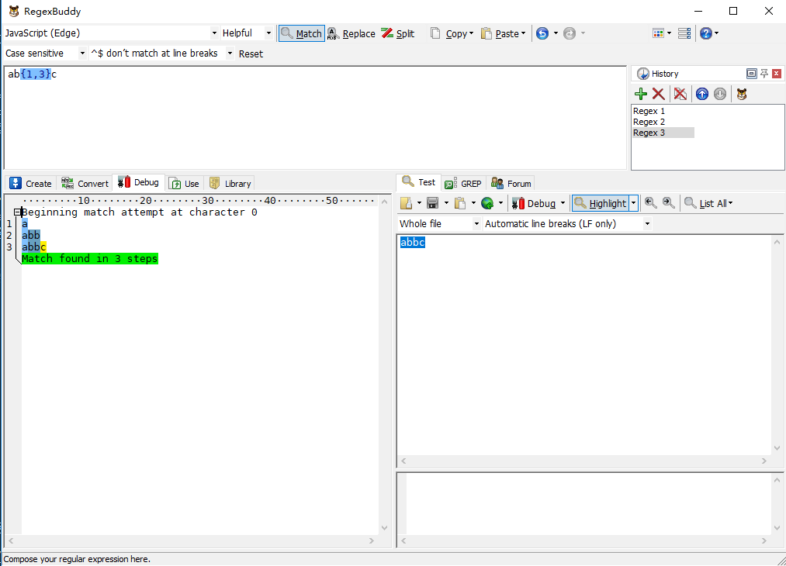
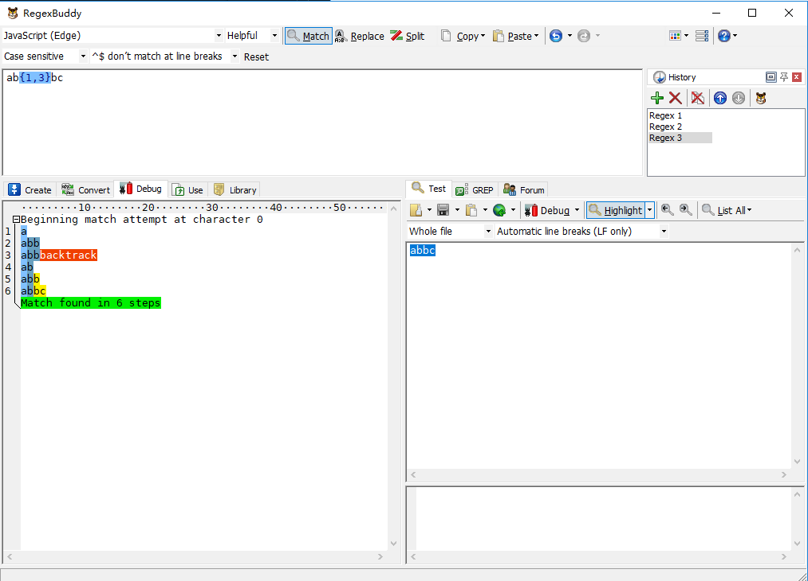
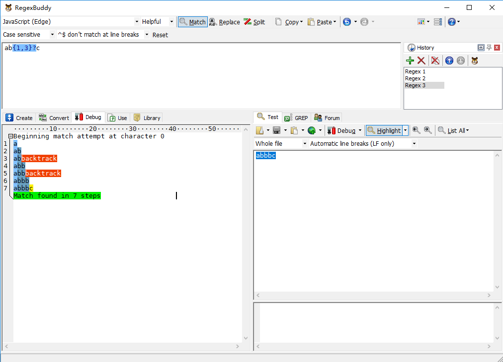
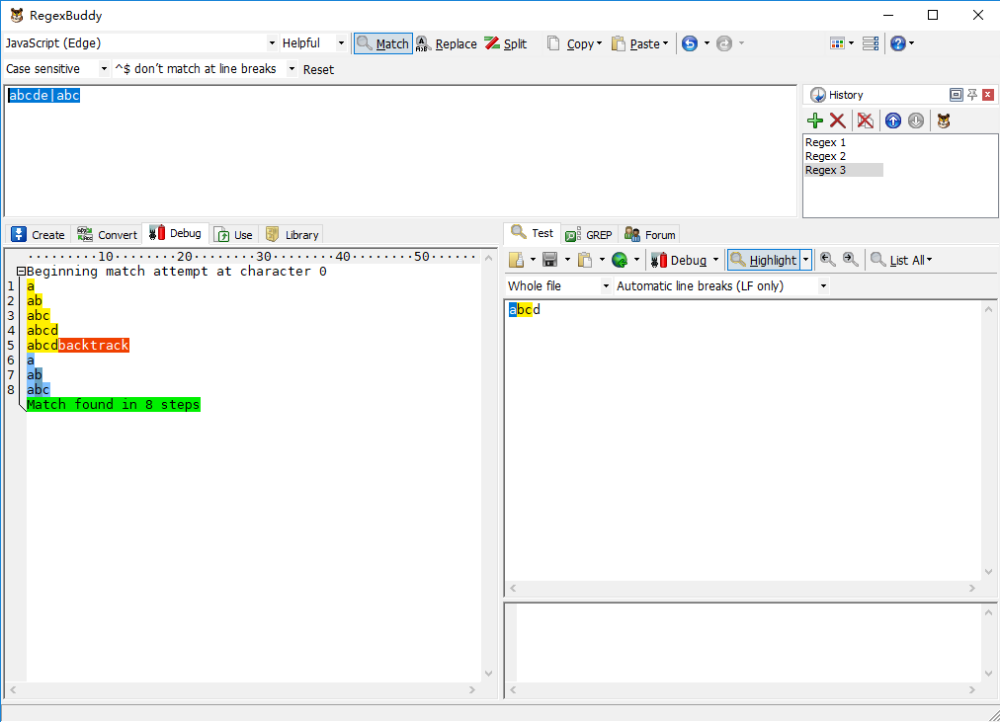

### 1. 什么是回溯法

以下是来自摘自维基百科的部分解析：

>回溯法是一种通用的计算机算法，用于查找某些计算问题的所有（或某些）解决方案，特别是约束满足问题，逐步构建候选解决方案，并在确定候选不可能时立即放弃候选（"回溯"）完成有效的解决方案。

>回溯法通常用最简单的递归方法来实现，在反复重复上述的步骤后可能出现两种情况：
>* 找到一个可能存在的正确的答案
>* 在尝试了所有可能的分步方法后宣告该问题没有答案

>在最坏的情况下，回溯法会导致一次复杂度为指数时间的计算。

### 2. 什么是正则回溯

正则引擎主要可以分为基本不同的两大类：一种是DFA(确定性有穷自动机，学过计算理论的应该都知道），另一种是NFA（非确定性有穷自动机）。NFA速度较DFA更慢，并且实现复杂，但是它又有着比DFA强大的多的功能，比如支持反向引用等。JavaScript的正则引擎是NFA型，NFA正则引擎的实现过程中使用了回溯，下面，就让我们先介绍一下什么是正则回溯。

#### 2.1 没有回溯的正则

举一个网上常见的例子，正则表达式/ab{1,3}c/g去匹配文本'abbc'，我们接下来会通过RegexBuddy分析其中的匹配过程，如果对RegexBuddy不熟悉，可以看我的[RegexBuddy教程](https://github.com/herofei/study/blob/master/%E6%AD%A3%E5%88%99/regexBuddy%E4%BD%BF%E7%94%A8%E6%95%99%E7%A8%8B.md)



如上图所示，让我们一步一步分解匹配过程：

1. 正则引擎先匹配 a
2. 正则引擎尽可能多地(贪婪)匹配 b
3. 正则引擎匹配 c，完成匹配

在这之中，匹配过程都很顺利，并没发生意外(回溯)。

不少网上的文章认为正则表达式/ab{1,3}c/g在贪婪模式下去匹配文本'abbc'应该会发生回溯：正则引擎尝试去匹配第三个b，然后发现是c，回溯上一步。但其实这是错的，这种纯粹的回溯方式只会发生在ε-NFA中，NFA正则引擎在以上情况则不会发生回溯。

#### 2.2 有正则回溯的正则
  
让我们把上面的正则修改一下，/ab{1,3}c/g改成/ab{1,3}bc/g，接下再通过RegexBuddy查看分析结果。



我们再一步一步分解匹配过程：

1. 正则引擎先匹配 a
2. 正则引擎尽可能多地(贪婪)匹配b{1,3}中的 b
3. 正则引擎去匹配 b，发现没 b 了，糟糕！赶紧回溯！
4. 返回b{1,3}这一步，不能这么贪婪，少匹配个 b
5. 正则引擎去匹配 b
6. 正则引擎去匹配 c，完成匹配

以上，就是一个简单的回溯过程。

### 3.正则回溯的几种常见形式

从上面发生正则回溯的例子可以看出来，正则回溯的过程就是一个试错的过程，这也是回溯算法的精髓所在。回溯会增加匹配的步骤，势必会影响文本匹配的性能，所以，要想提升正则表达式的匹配性能，了解回溯出现的场景(形式)是非常关键的。

#### 3.1 贪婪量词

在NFA正则引擎中，量词默认都是贪婪的。当正则表达式中使用了下表所示的量词，正则引擎一开始会尽可能贪婪的去匹配满足量词的文本。当遇到匹配不下去的情况，就会发生回溯，不断试错，直至失败或者成功。

量词|说明
:---|:--
a* | 0 or more
a+ | 1 or more
a? | 0 or 1
a{5} | exactly five
a{2,} | two or more
a{1,3} | between one & three


当多个贪婪量词挨着存在，并相互有冲突时，秉持的是"先到先得"的原则，如下所示：

```
let string = "12345";

let regex = /(\d{1,3})(\d{1,3})/;
console.log( string.match(regex) );
// => ["12345", "123", "45", index: 0, input: "12345"]

```

#### 3.2 惰性量词

贪婪是导致回溯的重要原因，那我们尽量以懒惰匹配的方式去匹配文本，是否就能避免回溯了呢？答案是否定的。

让我们还是看回最初的例子，/ab{1,3}c/g去匹配abbc。接下来，我们再把正则修改一下，改成/ab{1,3}?c/g去匹配abbc，以懒惰匹配的方式去匹配文本，RegexBuddy执行步骤如下图所示：



1. 正则引擎先匹配 a
2. 正则引擎尽可能少地(懒惰)匹配b{1,3}中的 b
3. 正则引擎去匹配 c，糟糕！怎么有个 b 挡着，匹配不了 c 啊！赶紧回溯！
4. 返回b{1,3}这一步，不能这么懒惰，多匹配个 b
5. 正则引擎再去匹配 c，糟糕！怎么还有 b 挡着，匹配不了c 啊！赶紧回溯！
6. 返回b{1,3}这一步，不能这么懒惰，再多匹配个 b
7. 正则引擎再去匹配 c，匹配成功，棒棒哒

本来是好端端不会发生回溯的正则，因为使用了惰性量词进行懒惰匹配后，反而产生了回溯了。所以说，惰性量词也不能瞎用，关键还是要看场景。

#### 3.3 分组

分支的匹配规则是：按照分支的顺序逐个匹配，当前面的分支满足要求了，则舍弃后面的分支。

举个简单的分支栗子，使用正则表达式去匹配 /abcde|abc/g 文本 abcd，还是通过RegexBuddy查看执行步骤：



1. 正则引擎匹配 a
2. 正则引擎匹配 b
3. 正则引擎匹配 c
4. 正则引擎匹配 d
5. 正则引擎匹配 e，糟糕！下一个并不是e，赶紧回溯！
6. 上一个分支走不通，切换分支，第二个分支正则引擎匹配 a
7. 第二个分支正则引擎匹配 b
8. 第二个分支正则引擎匹配 c，匹配成功

由此，可以看出，分组匹配的过程，也是个试错的过程，中间是可能产生回溯的。

### 4.相关引用以及参考

[正则表达式的几种引擎](http://blog.huanghao.me/?p=55)

[wikipedia Backtracking](https://en.wikipedia.org/wiki/Backtracking)

[正则表达式回溯法原理](https://zhuanlan.zhihu.com/p/27417442)