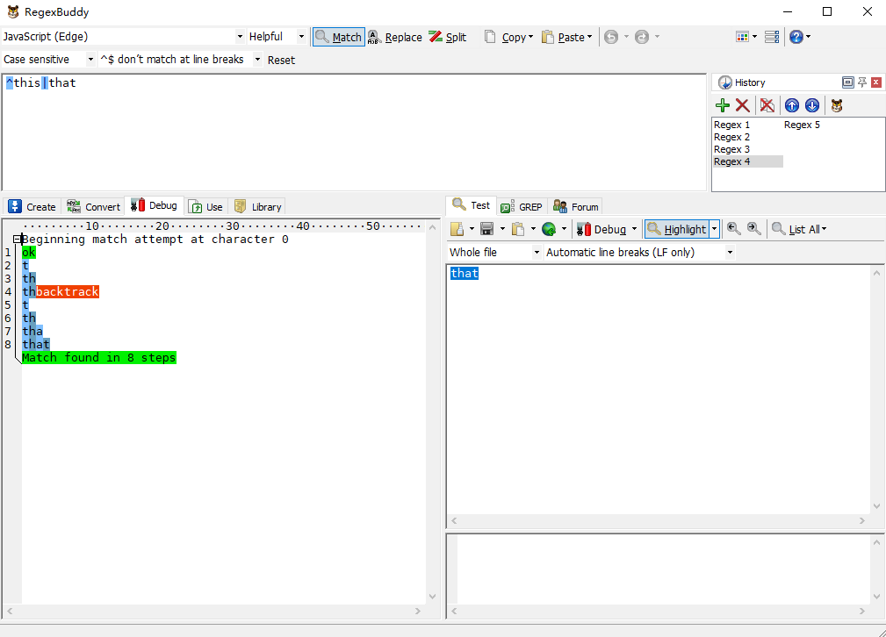

正则是个很好用很逆天的东西，如果使用得当，如有神助。当如果使用不当，则是处处埋坑。所以这篇文章我们重点谈论如何有效使用正则，写一个高性能的正则表达式。

### 1. 是否一定要要正则

首先，你是否当前的需求是否一定要用到正则。

其实很多简单的字符串匹配或者替换操作都可以用String的原型方法解决，而无需动用正则。如下列代码所示：

```
let str = '2017-01-02';

// 转换文本 2017-01-02 为 2017/01/02
// 用正则我们可能简单写成以下形式

str.replace(/(\d{4})-(\d{1,2})-(\d{1,2})/g,'$1/$2/$3');

// 其实可替换成
str.split('-').join('/');
```

```
let str = '1212abc1212';

// 判断字符串是否含有abc

/abc/.test(str);

// 其实可替换成
str.indexOf('abc') !== -1
```

### 2. 避免量词嵌套

举个简单的例子对比：

我们使用正则表达式/a*b/去匹配字符串aaaaa，看下图RegexBuddy的执行过程：


我们将以上正则修改成/(a*)*b/去匹配字符串aaaaa，再看看RegexBuddy的执行结果过程：


以上两个正则的基本执行步骤可以简单认为是：

1. 贪婪匹配
2. 回溯
3. 直至发现匹配失败

但令人惊奇的是，第一个正则的从开始匹配都匹配失败这个过程只有14步。而第二个正则却有128步之多。可想而知，嵌套量词会大大增加正则的执行过程。因为这其中进行了两层回溯，这个执行步骤增加的过程就如同算法复杂度从O(n)上升到O(n^2)的过程一般。

所以，面对量词嵌套，我们需作出适当的转化消除这些嵌套：

```
(a*)* <=> (a+)* <=> (a*)+ <=> a*
(a+)+ <=> a+
```

### 3. 使用非捕获组

### 4. 分支优化

分支也是导致正则回溯的重要原因，所以，针对正则分支，我们也需要作出必要的优化。

#### 4.1. 减少分支数量

首先，需要减少分支数量。比如不少正则在匹配http和https的时候喜欢写成：

```
/^http|https/
```

其实上面完全可以优化成：

```
/^https?/
```

这样就能减少没必要的分支回溯

#### 4.2. 缩小分支内的内容

缩小分支中的内容也是很有必要的，例如我们需要匹配 this 和 that ，我们也许会写成：

```
/this|that/
```

但上面其实完全可以优化成

```
/th(?:is|at)/
```

有人可能认为以上没啥区别，实践出真知，让我们用以上两个正则表达式去匹配一下that。




我们会发现第一个正则的执行步骤比第一个正则多两步，那是因为第一个正则的回溯路径比第二个正则的回溯路径更长了，最终导致执行步骤变长。

### 5. 分解复杂正则


## 总结
